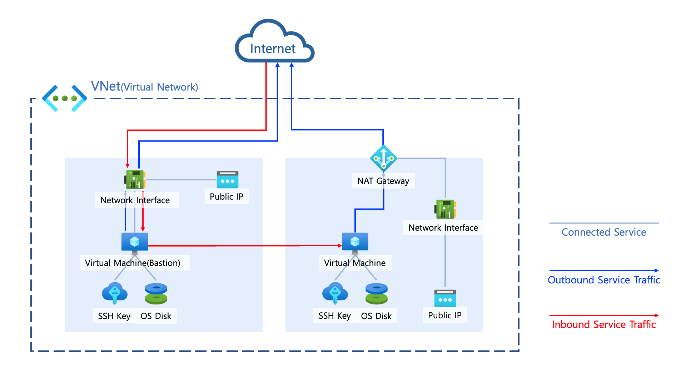

> ## Create Azure Virtual Machine Use Terraform

#### Terraform으로 기본적인 IaaS 구축을 진행합니다. (모듈 사용 X)

<br>

- 테스트 환경
	- PC: Apple MacBook Air 2020(M1)
	- OS: macOS Monterey 12.3.1
	- IDE: Visual Studio Code 1.66.1
	- Terraform: v1.1.8 (on darwin_arm64), brew install
	- Azure CLI: stable 2.35.0 (Microsoft Azure CLI 2.0)

<br>

---

> ### 전체 구성도



---

> ### Azure VM 접속 방식

- Password로 접근하는 방식
- SSH Key를 이용하여 접근하는 방식
2가지가 있고 이 글에서는 SSH Key를 이용하여 접근하는 방식을 사용합니다.

<br>

ssh-keygen을 이용하여 키를 생성하는 방법은 아래를 참고하시면됩니다.

```
$ ssh-keygen
```
```
# WorkSpace 디렉터리 지정
Generating public/private rsa key pair.
Enter file in which to save the key (/Users/user/.ssh/id_rsa): /WorkSpace/KP/testvm-public
```
```
# 비워 두시면 됩니다.
Enter passphrase (empty for no passphrase): 
```
```Enter same passphrase again: 
Your identification has been saved in /WorkSpace/KP/testvm-public
Your public key has been saved in /WorkSpace/KP/testvm-public.pub
The key fingerprint is:
SHA256:Oc/6iqU5MI1JkOjuws3WRupObvo0L/lBEYLD5kwAu/o
The key's randomart image is:
+---[RSA 3072]----+
|*..o .           |
|.Bo . .          |
|B .. .           |
| =  . .  .       |
|o  . =  S        |
|..  *..  +       |
|+ o+=+  . o      |
|.++Oooo= .       |
|..E=+o+.oo.      |
+----[SHA256]-----+
```

위와 같은 방법을 사용하여 Bastion Host 와 Private VM을 위한 Key를 각각 생성해 주시면됩니다.
- 파일이름
	- Bastion Host: testvm-public
	- Private VM: testvm-private

---

> ### Azure Cli 로그인

Azure 인프라를 Terraform으로 컨트롤 하려면 Azure에 로그인을 하셔야합니다.
방법은 간단합니다.

```
$ az login
```

웹사이트로 이동하고 로그인하면 cli도 로그인됩니다.
정상적으로 로그인 되었는지 확인해봅니다.

```
$ az account show -o json
```

계정과 테넌트가 정상적으로 확인되면 끝입니다.

---

### - 전체 파일

- main.tf
	- Provider 선언
	- Resource Group 확인 및 생성
	- VNet 생성
	- Subnet 생성
	- NAT Gateway 생성
	- Resource Association
- data.tf
	- Resource Group 존재여부 체크를 위한 데이터
- output.tf
	- Resource Group가 기존에 있었는지 확인
	- NAT Gateway Public IP 확인
	- Bastion Host Public IP 확인
- sg.tf
	- SSH 허용을 Security Group으로 정의(단일 리소스가 내용이 길어서 별도로 빼놨습니다.)
- test.tf
	- Bastion Host 및 Private Virtual Machine 생성 정의(NIC, SSH Key 등)


---

> ### Terraform Apply

```
# 실행 유효성 검사
terraform validate

# 배포
terraform apply --auto-approve
```

---

> ### 참고사항


 Azure VM은 인터넷 통신을 하기위해 별도로 Route Table을 설정할 필요가 없습니다.  
기본적으로 Outbound 통신이 가능합니다.  
하지만 NAT Gateway를 두고 통신하는 것이 좋습니다.  
AWS와는 설정하는게 달라 좀 까다롭긴했네요  

또 Liunx Virtual Machine에서는 traceroute와 ping명령어가 정상적으로 동작하지 않습니다.  
네트워크 테스트는 curl로 진행하시면 될 듯 하네요  

- 로컬에 Docker nginx이미지를 가동하고 Azure VM에서 로컬 nginx container로 curl요청을 보냅니다.
	확인은 docker logs -n 10 (Container ID) 로 확인하시면 됩니다.
	
	```sh
	$ sudo docker logs -n 10 cf4 
	58.150.221.203 - - [19/Apr/2022:08:50:08 +0000] "POST ~~~~~~~~~
	```